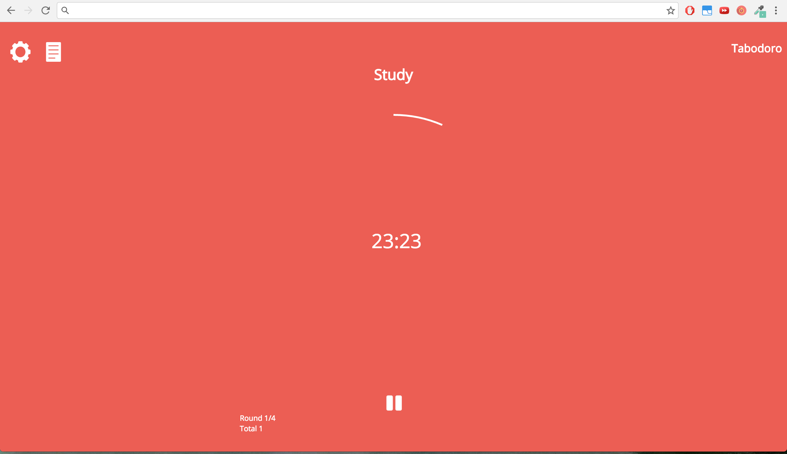
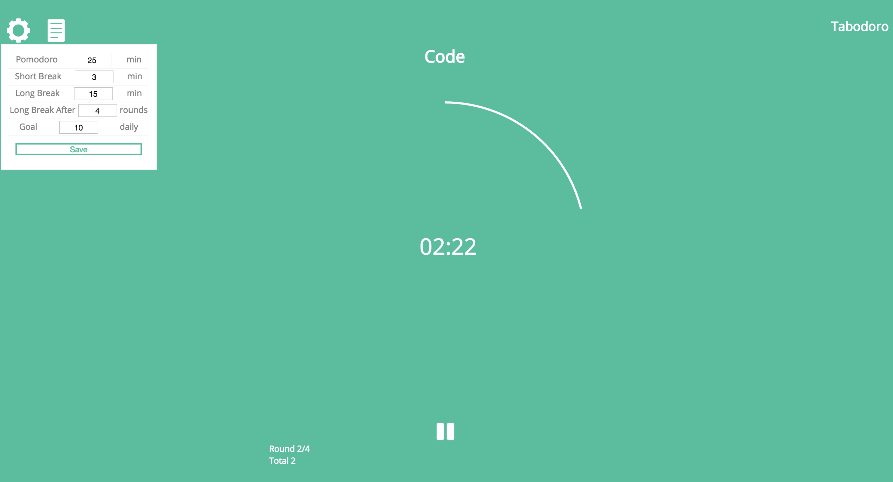
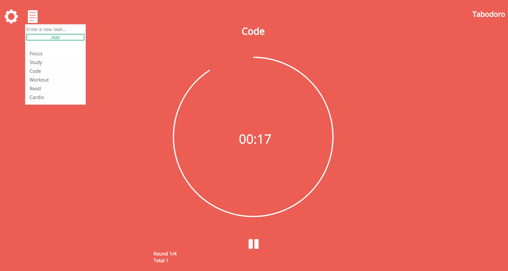

## Tabodoro

### Background

The pomodoro technique is a time management method developed by Francesco Cirillo in the late 1980s. It works by using a timer to designate work intervals, typically 25 min in length, separated by short 5 min breaks.  These intervals are known as pomodoros.  

Tabodoro is a Chrome extension that turns new tab pages into a pomodoro timer page, where users can set the length of their pomodoros and break intervals, as well as how many they wish to complete.  Users can also provide labels to their pomodoros to remind themselves of the task at hand.

### Functionality & MVP

- [ ] Turn new tab pages into a pomodoro timer
- [ ] Set the length of work and break intervals on the timer
- [ ] Label their pomodoros
- [ ] Save settings to sync across all machines using chrome storage

### Wireframes





### Technologies and Implementation Details

- `React`
- `chrome.storage` API
- `webpack`

The React structure consists of Timer, Settings, and Task components. When each component mounts they each first fetch any stored information that pertains to them using `chrome.storage.sync.get`.  This function call is passed the keys to look up in chrome storage, along with default values in case nothing is stored.  These key-value pairs are obtained from the state of the component, which is initialized with default values.  The API call is also passed a callback which updates the state with the values found in storage, triggering a re-render.

```javascript
componentDidMount() {
  this.fetchSettings();
}

fetchSettings() {
  chrome.storage.sync.get(this.state, ({pomodoroLen, breakLen, longBreakLen, longBreakAfter, goal}) => {
    this.setState({pomodoroLen, breakLen, longBreakLen, longBreakAfter, goal});
  });
}
```

Similarly, whenever users alter the default settings, these changes are saved using `chrome.storage.sync.set`.

When the timer is active, a circle is drawn around the displayed time such that the circle will complete just as the timer hits zero. This was achieved using an `svg circle` and manipulating the `stroke-dashoffset`.

Each time the timer updates its display, the stroke-dashoffset for the circle is updated as well according to how much time has elapsed and how much remains.

```javascript
let circle = document.getElementsByClassName('circle-animation');
let c = circle[0].style;
let updatedTime = this.state.elapsedTime + 1;

let timerDuration = this.state.workInterval ? this.state.intervalLength : this.state.breakIntervalLen

// the initialOffset is set to the circumference of the circle
c.strokeDashoffset = initialOffset-((updatedTime)*((initialOffset)/timerDuration));
```
#To-do

- [ ] Blacklist certain websites from being visited while work interval is active
- [ ] Better alert/ringer for when timer intervals have ended
- [ ] Integrate Google charts in to allow users to visually track their progress
