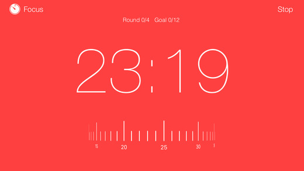
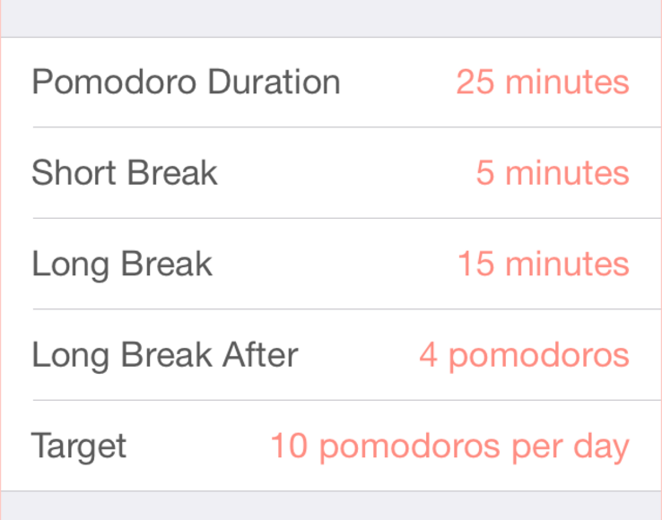
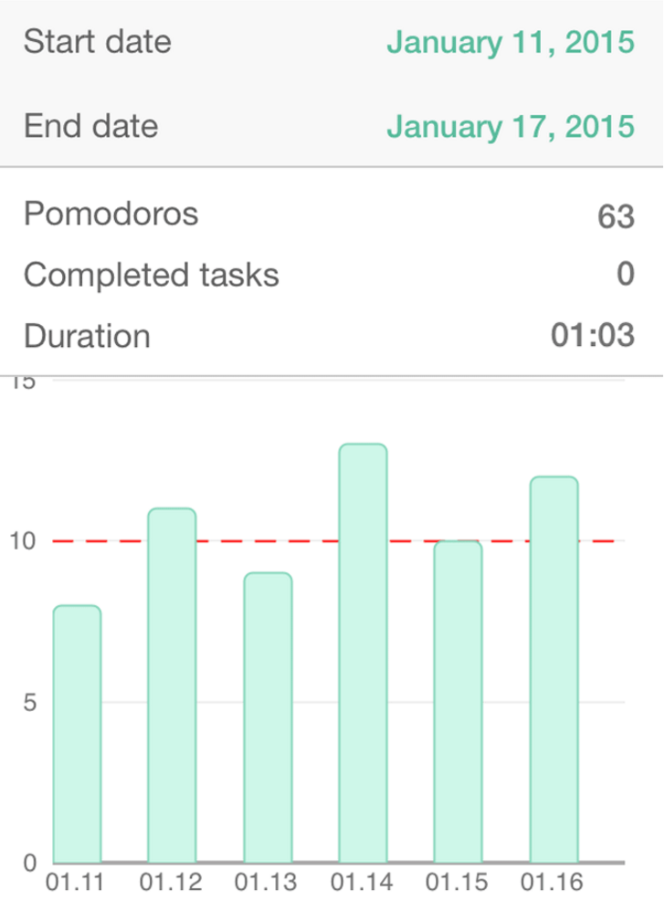

## Tabodoro

### Background

The pomodoro technique is a time management method developed by Francesco Cirillo in the late 1980s. It works by using a timer to designate work intervals, typically 25 min in length, separated by short 5 min breaks.  These intervals are known as pomodoros.  

Tabodoro is a Chrome extension that turns new tab pages into a pomodoro timer page, where users can set the length of their pomodoros and break intervals, as well as how many they wish to complete.  Users can also provide labels to their pomodoros, and select websites to be "blacklisted" while a work interval is taking place.  

### Functionality & MVP

With this extension, users will be able to:

- [ ] Turn new tab pages into a pomodoro timer
- [ ] Set the length of work and break intervals on the timer
- [ ] Label their pomodoros
- [ ] Blacklist certain websites from being visited during work intervals

### Wireframes

### Technologies

This extension will be implemented using standard Chrome extension technology: Javascript, HTML, and CSS.

If time permits, Google Charts will be used to allow users to track their completed pomodoros and trends over time.

### Implementation Timeline

**Day 1**: Get started on the infrastructure of the extension, following <a href="https://developer.chrome.com/extensions/getstarted">this guide</a> from Chrome.  By the end of the day, I will have:

- A completed `package.json`
- A completed `manifest.json`

**Day 2**: Implement the timer and be able to display as the new tab page. Get the majority of styling, or at least the stylistic "theme", completed.

**Day 3**: Allow users to edit the duration and number of pomodoros that they wish to complete, and to provide labels. Allow users to save these pomodoro session settings. Continue styling.

**Day 4**: Implement the ability to blacklist select websites while a work interval is active. Finish styling.

**BONUS** If time, implement the tracking of usage and visualization of usage trends with Google Charts. Also, integrate with Facebook to allow sharing of progress and invite friends to install Tabodoro.
